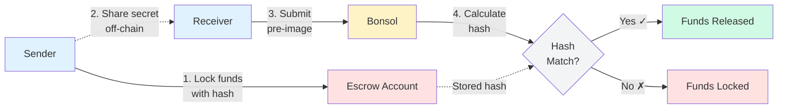

## Hash Locked Fund Escrow

This example demonstrates a hash locked escrow system on Solana, where funds are locked in an escrow and can only be claimed by providing the correct preimage for a stored hash.

### Components

- **data-server**: Node.js server providing a public endpoint that returns a 32-byte value as public input.
- **sha**: Bonsol application that computes the SHA-256 hash of the provided public input.
- **sol-program**: Solana program with three instructions:
	- `initialize_escrow`: Initializes an escrow and locks the specified amount of lamports.
	- `claim_escrow`: Allows a user to claim the escrow by submitting a preimage; requests the hash from the Bonsol program.
	- `handle_claim_callback`: Receives the hash from Bonsol and, if it matches the escrow's hash, releases funds to the receiver.
- **client**: TypeScript client to interact with the Solana program and call escrow instructions.

**Flow:**
1. Escrow is initialized with a hash and locked funds.
2. Anyone with the correct preimage can claim the escrow.
3. The claim process verifies the hash via Bonsol before releasing funds.

## Flow Diagram

## Process Steps

### 1. Create Escrow Account
Sender locks funds in an escrow account with SHA-256 hash of secret

### 2. Share Secret
Sender gives pre-image to receiver off-chain

### 3. Claim Funds
Receiver submits pre-image to unlock

### 4. Verify & Release
Bonsol computes hash, Solana verifies and releases

## Why Bonsol?

Bonsol enables off-chain SHA-256 computation with zero-knowledge proofs, allowing larger input sizes than native Solana constraints. The system ensures trustless verification: funds only release when the correct pre-image is provided.
